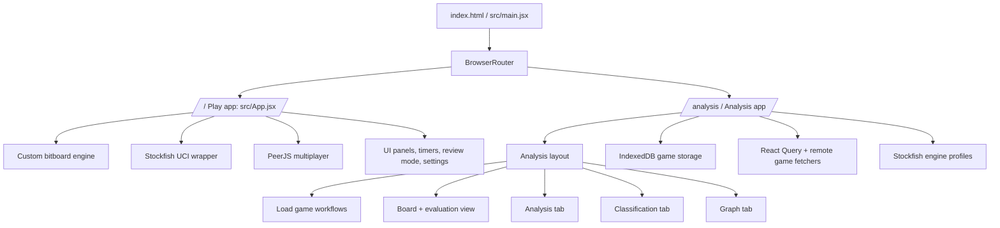

# PROJECT.md

This file is the working reference for the repository. It is intentionally detailed and opinionated so it can function as the single source of truth for the codebase structure, responsibilities, risks, and future refactor boundaries.

## 1. Repository Identity

- Product: browser chess application with local play, AI play, review mode, multiplayer, and a dedicated analysis workspace.
- Runtime stack: React 19, Vite 7, Jotai, React Query, MUI, Recharts, chess.js, PeerJS, Stockfish WASM/worker wrappers.
- Build style: client-side SPA with Vite base path support and Netlify deployment headers for SharedArrayBuffer-enabled Stockfish.
- Primary architectural split: the play app lives at the root route, while the analysis app is lazy loaded and routed separately.

## 2. System Map

## 3. Routing And Boot

The application boots in [src/main.jsx](src/main.jsx). It creates a `BrowserRouter` with `basename={import.meta.env.BASE_URL || '/'}` and routes directly to the play app or the analysis app. The analysis app is lazily loaded, wrapped in its own `QueryClientProvider`, and rendered through a lightweight loading screen while the chunk is fetched.

Important consequences:

- Deep links are supported through the router instead of manual pathname checks.
- The analysis area does not load its heavier vendor and engine dependencies until needed.
- The app depends on SPA fallback behavior in [netlify.toml](netlify.toml) so non-file routes resolve to `index.html`.

## 4. Top-Level Repository Inventory

### Files at the root

- [package.json](package.json) - package metadata, dependencies, scripts, and runtime entry.
- [vite.config.js](vite.config.js) - base path, aliasing, worker-oriented build split, dev server config.
- [netlify.toml](netlify.toml) - deploy-time SPA fallback and headers.
- [index.html](index.html) - Vite HTML entry point.
- [README.md](README.md) - project-facing overview and setup notes.
- [code_audit_report.md](code_audit_report.md) - earlier audit notes; useful as prior analysis, not authoritative over live code.
- [FEATURES_TO_BE_ADDED.md](FEATURES_TO_BE_ADDED.md) - future work ideas.
- [FIXED_UI.md](FIXED_UI.md) - UI changes already documented by the project.
- [eslint.config.js](eslint.config.js) - lint configuration.
- [lint.json](lint.json) - lint output artifact.
- [eslint_report.json](eslint_report.json) - lint output artifact.
- [test-perft.mjs](test-perft.mjs) - engine/perft verification script.
- [update-app.mjs](update-app.mjs) - migration or update script.
- [update.txt](update.txt) - project note or change log artifact.

### Major directories

- [src](src) - application source.
- [public](public) - static deploy assets, engine bundles, generated manifests, and piece/theme assets.
- [assets](assets) - source asset libraries and sprite packs used by the build and manifest scripts.
- [engine-src](engine-src) - native engine source artifact, currently present as a large C++ file.
- [scripts](scripts) - asset and build support scripts.
- [sounds](sounds) - source audio assets.

## 5. Directory Atlas

### `src/`

- [src/main.jsx](src/main.jsx) - router bootstrap and lazy analysis mount.
- [src/App.jsx](src/App.jsx) - play-app orchestrator and primary state owner.
- [src/index.css](src/index.css) - global styling.

#### `src/components/`

Core UI for the play app lives here. The important surfaces are:

- [src/components/ChessBoardView.jsx](src/components/ChessBoardView.jsx) - interactive board rendering, drag/drop, highlights, move markers.
- [src/components/GamePanel.jsx](src/components/GamePanel.jsx) - move list, review controls, game actions.
- [src/components/RightPanel.jsx](src/components/RightPanel.jsx) - game setup and configuration panel.
- [src/components/SettingsModal.jsx](src/components/SettingsModal.jsx) - visual settings, theme selection, board surfaces, background options.
- [src/components/DrawOfferModal.jsx](src/components/DrawOfferModal.jsx) - draw offer flow.
- [src/components/GameOverModal.jsx](src/components/GameOverModal.jsx) - end-state display.
- [src/components/PawnPromotionUI.jsx](src/components/PawnPromotionUI.jsx) - promotion picker.
- [src/components/Sidebar.jsx](src/components/Sidebar.jsx) - side navigation / support panel.
- [src/components/PlayerCard.jsx](src/components/PlayerCard.jsx) - player identity and time display.
- [src/components/EvaluationBar.jsx](src/components/EvaluationBar.jsx) - live eval display for the play app.
- [src/components/MobileStartGamePanel.jsx](src/components/MobileStartGamePanel.jsx) - mobile-specific game start controls.
- [src/components/ModeSelectScreen.jsx](src/components/ModeSelectScreen.jsx) - mode selection screen.
- [src/components/MultiplayerLobbyScreen.jsx](src/components/MultiplayerLobbyScreen.jsx) - P2P lobby UI.

#### `src/components/start/`

Shared start-panel helpers:

- [src/components/start/StartPanelSections.jsx](src/components/start/StartPanelSections.jsx) - time-control and difficulty section renderers.
- [src/components/start/styleHelpers.js](src/components/start/styleHelpers.js) - hover and button styling helpers.

#### `src/engine/`

This is the play-app engine boundary.

- [src/engine/index.js](src/engine/index.js) - engine initialization entry.
- [src/engine/pgn.js](src/engine/pgn.js) - PGN generation and result formatting.
- [src/engine/bitboard/](src/engine/bitboard) - persistent bitboard implementation, move generation, tables, notation, and attack logic.

#### `src/hooks/`

- [src/hooks/useGameEngine.js](src/hooks/useGameEngine.js) - mutable persistent chess state and legal move generation coordination.
- [src/hooks/useChessTimer.js](src/hooks/useChessTimer.js) - clock timing and timeout handling.
- [src/hooks/usePawnPromotion.js](src/hooks/usePawnPromotion.js) - promotion state management.
- [src/hooks/useReviewMode.js](src/hooks/useReviewMode.js) - review playback and navigation.
- [src/hooks/useStockfish.js](src/hooks/useStockfish.js) - engine integration for live eval and best-move search.
- [src/hooks/useP2PGame.js](src/hooks/useP2PGame.js) - PeerJS multiplayer session lifecycle.

#### `src/lib/` and `src/utils/`

- [src/lib/engine/uciEngine.js](src/lib/engine/uciEngine.js) - UCI worker orchestration and search lifecycle.
- [src/lib/engine/worker.js](src/lib/engine/worker.js) - worker sizing and coordination helpers.
- [src/lib/engine/shared.js](src/lib/engine/shared.js) - engine support checks and shared engine utilities.
- [src/lib/engine/analysisProtocol.js](src/lib/engine/analysisProtocol.js) - protocol for analysis search messages.
- [src/utils/stockfishUtils.js](src/utils/stockfishUtils.js) - engine profile definitions, clamp functions, evaluation helpers.
- [src/utils/sounds.js](src/utils/sounds.js) - play-app sound loading and playback.
- [src/utils/assetPath.js](src/utils/assetPath.js) - base-path-safe asset resolution.

#### `src/constants/`

- Board/theme presets live here and are mirrored into the settings surfaces.

#### `src/data/`

- Data and persisted app state helpers live here.

### `src/analysis/chessapp/`

The analysis app is a separate feature area, lazily loaded and organized around a board, an analysis page, load/save workflows, and engine classification output.

#### High-value files

- [src/analysis/chessapp/pages/index.jsx](src/analysis/chessapp/pages/index.jsx) - analysis page composition and tab state.
- [src/analysis/chessapp/sections/layout/index.jsx](src/analysis/chessapp/sections/layout/index.jsx) - layout wrapper and local storage-backed theme state.
- [src/analysis/chessapp/hooks/useEngine.js](src/analysis/chessapp/hooks/useEngine.js) - analysis engine selection and engine support checks.
- [src/analysis/chessapp/hooks/useChessActions.js](src/analysis/chessapp/hooks/useChessActions.js) - chess.js mutation wrapper used across analysis board and panel flows.
- [src/analysis/chessapp/hooks/useGameDatabase.js](src/analysis/chessapp/hooks/useGameDatabase.js) - IndexedDB storage and URL-backed game loading.
- [src/analysis/chessapp/hooks/useGameData.js](src/analysis/chessapp/hooks/useGameData.js) - derived board/game metadata from atom state.
- [src/analysis/chessapp/hooks/usePlayersData.js](src/analysis/chessapp/hooks/usePlayersData.js) - player identity, ratings, and avatar fetching.
- [src/analysis/chessapp/hooks/useLocalStorage.js](src/analysis/chessapp/hooks/useLocalStorage.js) - browser storage helper.
- [src/analysis/chessapp/hooks/useDebounce.js](src/analysis/chessapp/hooks/useDebounce.js) - small debounce helper for remote game lookup inputs.
- [src/analysis/chessapp/hooks/useScreenSize.js](src/analysis/chessapp/hooks/useScreenSize.js) - board sizing helper.

#### Analysis UI sections

- [src/analysis/chessapp/sections/analysis/](src/analysis/chessapp/sections/analysis) - tabbed analysis workspace.
- [src/analysis/chessapp/sections/play/](src/analysis/chessapp/sections/play) - play-style board and recap view for the analysis app.
- [src/analysis/chessapp/sections/loadGame/](src/analysis/chessapp/sections/loadGame) - PGN, Lichess, and Chess.com load flows.
- [src/analysis/chessapp/sections/engineSettings/](src/analysis/chessapp/sections/engineSettings) - engine tuning dialog and worker configuration.
- [src/analysis/chessapp/components/](src/analysis/chessapp/components) - board primitives, typography helpers, sliders, and labels.
- [src/analysis/chessapp/lib/](src/analysis/chessapp/lib) - analysis-specific chess helpers, engine wrappers, sound loading, public path helpers, and remote providers.
- [src/analysis/chessapp/types/](src/analysis/chessapp/types) - enums and shared analysis types.
- [src/analysis/chessapp/shims/](src/analysis/chessapp/shims) - environment compatibility wrappers.

### `public/`

- Engine bundles and their versioned directories live here: [public/engines](public/engines).
- Static analysis asset manifests live here: [public/assets/asset-manifest.json](public/assets/asset-manifest.json).
- Board and piece sprites are served from [public/assets](public/assets) and [public/piece](public/piece).
- Browser-visible icons and sounds are stored here as deployable assets.

### `assets/`

This folder is the source asset library that mirrors the deployable assets in `public/`.

- [assets/boards](assets/boards) - board textures and board images.
- [assets/moves](assets/moves) - move classification icons and related UI images.
- [assets/piece](assets/piece) - piece sets.
- [assets/piecesBMP](assets/piecesBMP) - bitmap piece assets.
- [assets/timecontrols](assets/timecontrols) - clock control graphics.

The piece-set folders present in the repository include: 3d_chesskid, 3d_plastic, 3d_staunton, 3d_wood, 8_bit, alpha, anarcandy, bases, blindfold, book, bubblegum, caliente, california, cardinal, cases, cburnett, celtic, chess7, chessnut, chicago, classic, club, companion, condal, cooke, dash, default, dubrovny, fantasy, firi, fresca, game_room, gioco, glass, gothic, governor, graffiti, horsey, icpieces, icy_sea, iowa, kiwen-suwi, kosal, leipzig, letter, light, lolz, maestro, marble, maya, merida, metal, modern, monarchy, mpchess, nature, neo, neo_wood, neon, newspaper, ocean, oslo, pirouetti, pixel, reillycraig, rhosgfx, riohacha, shapes, sky, space, spatial, staunty, symmetric, tatiana, tigers, tournament, vintage, wood, xkcd.

### `engine-src/`

- [engine-src/enginecode.cpp](engine-src/enginecode.cpp) is a large native source artifact that is present in the repository but is not part of the Vite runtime path.

## 6. Runtime Architecture

### Play app

The play app is orchestrated by [src/App.jsx](src/App.jsx). It owns game mode selection, board state lifecycle, timer logic, review mode, settings, multiplayer handoff, sound playback, and engine interactions. In practice, this component is the control plane for the whole play experience.

Major responsibilities observed in the live code:

- engine initialization and persistent position management through `useGameEngine`
- move execution, undo, review, and check/game-over handling
- computer move selection through Stockfish integration
- multiplayer room setup and remote move synchronization
- time control state and UI selection
- theme and board configuration persistence
- analysis handoff from the play app to the analysis route

### Analysis app

The analysis app is a separate feature system under [src/analysis/chessapp](src/analysis/chessapp). It is organized around atom state, chess.js mutation helpers, remote game loading, and analysis visualization. The active page at [src/analysis/chessapp/pages/index.jsx](src/analysis/chessapp/pages/index.jsx) composes the board, header, toolbar, and analysis tabs.

The analysis app has three important layers:

- state atoms in `sections/analysis/states.js` and adjacent state helpers
- workflow hooks such as `useChessActions`, `useGameDatabase`, `usePlayersData`, and `useEngine`
- UI sections for board, load game, analysis tab, classification tab, and graph tab

## 7. Execution Flow

### Play flow

1. `main.jsx` mounts the router and sends the user to `/` or `/analysis`.
2. `App.jsx` initializes the bitboard engine and restores persisted settings.
3. A game mode is chosen, and UI capabilities are derived from that mode.
4. Moves are generated by the bitboard engine, then applied through the React state bridge.
5. If enabled, the timer and review systems react to the current position.
6. Stockfish can provide live evaluation or best-move search.
7. Multiplayer sessions synchronize moves through the PeerJS connection.
8. At game end, the UI shows the game-over, recap, or review surfaces.

### Analysis flow

1. The user navigates to `/analysis`.
2. The analysis layout and page load lazily.
3. A game is loaded from PGN, Chess.com, Lichess, a local database entry, or a handoff payload.
4. The board and game atoms are populated.
5. The engine evaluates the game, classifies moves, and stores analysis output.
6. The analysis tab renders summary metrics and best-move context.
7. The classification tab renders move quality categories and recaps.
8. The graph tab visualizes evaluation over time and allows navigation back into the game state.

## 8. Chess Engine Audit

### Live engine design

The play engine is a custom bitboard implementation that uses BigInt-based board state and legal move generation. The key design points are:

- persistent `Position` state rather than reconstructing from scratch every move
- legal move generation separated from rendering concerns
- attack, pin, and check logic kept inside the engine layer
- explicit PGN generation and notation helpers outside the render tree

### Strengths

- The engine is clearly isolated from React, which keeps UI state from corrupting move legality.
- Legal-move generation is not delegated to the browser chess library for the play app.
- The engine supports review snapshots and undo-style navigation.

### Risks

- The engine is sophisticated enough that small logic changes can create silent rule regressions.
- A lot of the app’s correctness depends on the interplay between mutable engine state and React rerenders.
- Multiplayer and review mode both rely on the same move history model, so history drift would surface in several subsystems at once.

### Verification surface

- [test-perft.mjs](test-perft.mjs) exists as a direct engine integrity check.
- [src/engine/pgn.js](src/engine/pgn.js) is the canonical PGN serialization path.
- [src/engine/bitboard/moveGen.js](src/engine/bitboard/moveGen.js) is the legal-move control point.

## 9. Stockfish And UCI Audit

The app supports multiple Stockfish profiles and uses a worker-backed UCI orchestration layer in [src/lib/engine/uciEngine.js](src/lib/engine/uciEngine.js). The live design includes worker sizing, profile resolution, engine fallback, multi-PV analysis, and analysis lifecycle control.

Important facts:

- The play app uses [src/hooks/useStockfish.js](src/hooks/useStockfish.js) as its higher-level integration.
- The analysis app has its own engine hook in [src/analysis/chessapp/hooks/useEngine.js](src/analysis/chessapp/hooks/useEngine.js).
- Deployment must allow WASM and cross-origin isolation for multithreaded engine support, which is why [netlify.toml](netlify.toml) sets the required headers.
- The app depends on browser support and host headers for the strongest Stockfish configuration, so deployment environment quality directly impacts engine performance.

## 10. Multiplayer Audit

The multiplayer mode is implemented with PeerJS in [src/hooks/useP2PGame.js](src/hooks/useP2PGame.js). The architecture is host/guest oriented with pin-based session IDs, message passing, and a close/disconnect lifecycle.

What this means architecturally:

- the game logic remains local, while the transport layer only ships move events and game state messages
- the multiplayer layer is sensitive to connection timing and cleanup correctness
- the play app has to guard against echoing remote actions back into the peer channel

This is a reasonable browser P2P design, but it is a stateful edge in a very large play component, so maintenance risk is high.

## 11. Analysis App Audit

### Why it matters

The analysis app is not an incidental screen. It is a second application surface with its own state layer, remote data loading, engine settings, and visualization controls.

### Core workflows

- loading PGN or remote game sources
- storing games in IndexedDB through [src/analysis/chessapp/hooks/useGameDatabase.js](src/analysis/chessapp/hooks/useGameDatabase.js)
- resolving player names and avatars through [src/analysis/chessapp/hooks/usePlayersData.js](src/analysis/chessapp/hooks/usePlayersData.js)
- mutating chess.js state through [src/analysis/chessapp/hooks/useChessActions.js](src/analysis/chessapp/hooks/useChessActions.js)
- rendering engine line graphs and move classifications

### Subsystem notes

- The board and evaluation UI are split into small focused components such as captured pieces, evaluation bar, player header, and square rendering.
- The analysis page is more modular than the play app, but it still depends on a broad shared utility layer.
- The analysis app’s value is high, because it combines local analysis, cloud fetches, and game persistence into a single workflow.

## 12. File And Folder Roles

### `src/main.jsx`

Bootstraps routing, lazy loading, and the error boundary.

### `src/App.jsx`

Primary play experience controller, state orchestrator, and largest maintenance risk in the repo.

### `src/components/ChessBoardView.jsx`

Board rendering and interaction surface for the play app.

### `src/components/GamePanel.jsx`

Move list and review UI for the play app.

### `src/components/RightPanel.jsx`

Setup, difficulty, and game management panel.

### `src/components/SettingsModal.jsx`

Theme and board appearance editing.

### `src/hooks/useGameEngine.js`

The play engine bridge that exposes the board model and move execution.

### `src/hooks/useStockfish.js`

Stockfish lifecycle and search coordination for the play app.

### `src/hooks/useP2PGame.js`

PeerJS transport and multiplayer room management.

### `src/engine/bitboard/moveGen.js`

Legal move generation and make/unmake move core.

### `src/lib/engine/uciEngine.js`

UCI wrapper that mediates worker-backed engine instances and analysis output.

### `src/utils/stockfishUtils.js`

Engine profiles, clamp logic, and evaluation helper functions.

### `src/analysis/chessapp/pages/index.jsx`

Analysis page root, tab orchestration, and route entry.

### `src/analysis/chessapp/hooks/useGameDatabase.js`

IndexedDB persistence and database-backed game loading.

### `src/analysis/chessapp/hooks/useChessActions.js`

Chess.js mutation helper used across the analysis board and controls.

### `src/analysis/chessapp/sections/analysis/panelHeader/analyzeButton.jsx`

Triggers evaluation, stores analysis results, and updates persisted evals.

### `src/analysis/chessapp/sections/analysis/panelToolbar/index.jsx`

Navigation buttons, board moves, and clipboard/export actions.

### `src/analysis/chessapp/sections/loadGame/loadGameDialog.jsx`

Load-new-game modal with PGN, Chess.com, and Lichess sources.

## 13. Verified Empty Or Legacy Surfaces

The repo contains some files that appear to be empty or effectively placeholder surfaces in the live tree. These should be treated as dead or unimplemented until proven otherwise:

- [src/analysis/chessapp/hooks/useCustomAnalysisEngine.js](src/analysis/chessapp/hooks/useCustomAnalysisEngine.js) - empty.
- [src/analysis/chessapp/hooks/useAnalysisBackend.js](src/analysis/chessapp/hooks/useAnalysisBackend.js) - empty.

These should not be assumed to carry production behavior.

## 14. Performance And Load Profile

### Strong points

- Analysis is lazy loaded instead of bundled into the initial play route.
- Vendor chunking in [vite.config.js](vite.config.js) separates MUI, Recharts, and chess.js from the application code.
- Static assets are cached aggressively in [netlify.toml](netlify.toml).
- The play app uses a custom engine rather than forcing all move logic through a heavyweight general-purpose library.

### Pressure points

- [src/App.jsx](src/App.jsx) is too large for reliable local reasoning.
- The analysis app duplicates several chess and engine helper patterns that could drift from the play app.
- Asset management is broad and theme-heavy, which makes consistency easy to break if new packs are added carelessly.
- Browser isolation requirements for Stockfish increase deployment sensitivity.

## 15. Code Smell Register

- God component risk in [src/App.jsx](src/App.jsx).
- Duplicated theme and board data across play settings and app state.
- Multiple layers of engine integration that require careful cleanup and lifecycle handling.
- Analysis app helper duplication around chess, engine, and remote fetch logic.
- Empty hooks that create the appearance of extension points without behavior.
- Mixed responsibilities between UI composition and business logic in some large analysis components.

## 16. Highest Priority Files

These are the files that deserve the most careful attention if you change behavior:

1. [src/App.jsx](src/App.jsx)
2. [src/engine/bitboard/moveGen.js](src/engine/bitboard/moveGen.js)
3. [src/lib/engine/uciEngine.js](src/lib/engine/uciEngine.js)
4. [src/hooks/useStockfish.js](src/hooks/useStockfish.js)
5. [src/hooks/useP2PGame.js](src/hooks/useP2PGame.js)
6. [src/analysis/chessapp/hooks/useGameDatabase.js](src/analysis/chessapp/hooks/useGameDatabase.js)
7. [src/analysis/chessapp/hooks/useEngine.js](src/analysis/chessapp/hooks/useEngine.js)
8. [src/analysis/chessapp/sections/analysis/panelHeader/analyzeButton.jsx](src/analysis/chessapp/sections/analysis/panelHeader/analyzeButton.jsx)
9. [src/analysis/chessapp/sections/analysis/panelBody/graphTab/index.jsx](src/analysis/chessapp/sections/analysis/panelBody/graphTab/index.jsx)
10. [src/analysis/chessapp/sections/loadGame/loadGameDialog.jsx](src/analysis/chessapp/sections/loadGame/loadGameDialog.jsx)

## 17. Refactor Roadmap

### Phase 1: Make the play app controllable

- Split [src/App.jsx](src/App.jsx) into route-aware orchestration, game-state services, and view composition.
- Move static theme and board option data into shared constants.
- Separate multiplayer transport, timer logic, and review mode wiring from the main render surface.

### Phase 2: Normalize analysis helpers

- Consolidate repeated analysis chess helpers.
- Keep IndexedDB, remote fetch, and engine evaluation concerns separated.
- Make the analysis page composition more declarative and less hook-dense.

### Phase 3: Stabilize deployment assumptions

- Keep router behavior aligned with `BASE_URL`.
- Preserve SharedArrayBuffer headers for Stockfish multithreading.
- Keep public asset resolution base-path-safe everywhere.

### Phase 4: Reduce asset drift

- Centralize board, piece, and background option definitions.
- Make new asset pack registration happen in one place.
- Avoid duplicating option lists in modal and app code.

## 18. Future Scalability Report

The repository can scale, but only if the current separation boundaries are respected.

Good scaling bets:

- keep the play app and analysis app as distinct route-level surfaces
- keep engine code isolated from React components
- keep asset loading base-path aware
- keep multiplayer transport dumb and stateless beyond session state

Bad scaling bets:

- adding more modes directly into [src/App.jsx](src/App.jsx)
- copying analysis helpers into new feature folders instead of sharing them intentionally
- letting asset and theme lists drift between settings and runtime code

## 19. Maintenance Notes

- The codebase contains many generated or mirrored asset folders. That is normal for a chess UI, but it means path verification matters.
- Some earlier audit notes are not authoritative because the live code has changed, especially routing and analysis lazy loading.
- The most reliable way to reason about the project is to start from [src/main.jsx](src/main.jsx), [src/App.jsx](src/App.jsx), [src/hooks/useStockfish.js](src/hooks/useStockfish.js), [src/hooks/useP2PGame.js](src/hooks/useP2PGame.js), and [src/analysis/chessapp/pages/index.jsx](src/analysis/chessapp/pages/index.jsx).

## 20. Bottom Line

This is a capable chess application with a strong custom engine, a real analysis workspace, and deployable engine support. The main structural problem is concentration of responsibility in the play app, followed by duplicated analysis and asset configuration surfaces. If you preserve the engine boundaries and reduce orchestration bloat, the codebase has a good path forward.