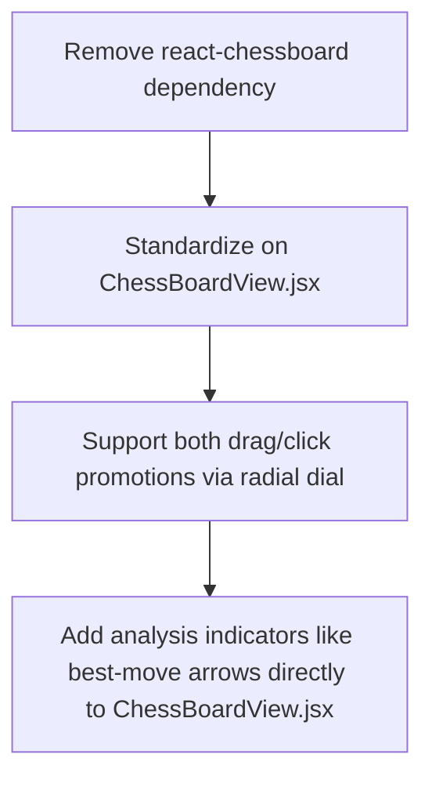

# Front-End Modularization & Refactoring Plan

This strategic plan outlines the steps required to refactor, simplify, and modularize the front-end architecture of the Chess Application. Currently, `src/App.jsx` is a 1300-line "mega-component" that handles layout, routing, timer ticks, P2P networking, audio cues, state management, modal logic, and rendering. 

By reorganizing code into domain-driven features, extracting logic into dedicated custom hooks, and implementing a unified reactive state layer, the application will become easier to maintain, style, and scale.

---

## 1. Directory Structure Blueprint

Below is the target structure for the refactored frontend. This moves all business logic out of `App.jsx` and places components in feature-scoped modules.

```
src/
├── assets/                    # Static UI resources (images, SVGs, audio)
│   ├── piece-sets/            # Graphics files categorized by theme style
│   ├── board-textures/        # Texture overlays (wood, marble, etc.)
│   └── sounds/                # Move sound effects (.mp3 files)
│
├── components/                # Reusable presentation components
│   ├── ui/                    # Core UI components
│   │   ├── Button.jsx
│   │   ├── Dialog.jsx
│   │   ├── Select.jsx
│   │   ├── Slider.jsx
│   │   └── GlassContainer.jsx # Shared premium frosted-glass overlay
│   │
│   └── chess/                 # Presentation-only chess components
│       ├── CapturedPieces.jsx # Consolidated captured pieces list
│       ├── EvaluationBar.jsx  # Shareable vertical centipawn bar
│       └── ChessBoardView.jsx # Consolidates chessboard SVG/Canvas renderer
│
├── constants/                 # Core theme configurations & presets
│   ├── themes.js              # Harmonious HSL colors for boards/backgrounds
│   ├── soundPresets.js        # Sound effect paths and metadata
│   └── gameModes.js           # Engine and multiplayer type settings
│
├── context/                   # Unified global React contexts (if not using Jotai)
│   └── UiThemeContext.jsx     # Controls global styling and preferences
│
├── features/                  # Domain-driven app modules
│   ├── play/                  # Play module: Human vs Local/AI/Multiplayer
│   │   ├── components/
│   │   │   ├── LocalMatch.jsx
│   │   │   ├── ComputerMatch.jsx
│   │   │   └── MultiplayerMatch.jsx
│   │   ├── hooks/
│   │   │   ├── useLocalPlay.js
│   │   │   ├── useComputerPlay.js
│   │   │   └── useMultiplayerPlay.js
│   │   └── PlayLayout.jsx     # Orchestrates playing board and HUD panel
│   │
│   ├── analysis/              # Analysis module: Engine evaluation
│   │   ├── components/
│   │   │   ├── EngineLines.jsx# Renders engine calculations (MultiPV)
│   │   │   ├── MoveInfo.jsx   # Selected move stats and annotations
│   │   │   └── EvalGraph.jsx  # Interactive centipawn progression chart
│   │   ├── hooks/
│   │   │   ├── useAnalysisEngine.js
│   │   │   └── useGameHistory.js
│   │   └── AnalysisLayout.jsx # Orchestrates analysis board, chart, and lines
│   │
│   ├── review/                # Review module: Game classification recap
│   │   ├── components/
│   │   │   ├── MoveClassificationIcon.jsx
│   │   │   └── GameRecapModal.jsx
│   │   └── ReviewLayout.jsx   # Post-game step-by-step move recap
│   │
│   ├── lobby/                 # Multiplayer lobby interface
│   │   ├── components/
│   │   │   ├── PeerConnectionDialog.jsx
│   │   │   └── LobbyRoom.jsx
│   │   └── LobbyLayout.jsx
│   │
│   └── settings/              # Settings & Preferences module
│       ├── components/
│       │   ├── BoardThemeConfig.jsx
│       │   ├── SoundVolumeConfig.jsx
│       │   └── EngineProfileConfig.jsx
│       └── SettingsLayout.jsx
│
├── hooks/                     # Application-wide stateful custom hooks
│   ├── useAudioPlayer.js      # Consolidated move classification audio cue driver
│   ├── useChessTimer.js       # Game clocks and countdown tick manager
│   ├── useP2PConnection.js    # PeerJS network wrapper and lobby handshake
│   └── useLocalStorage.js     # React settings synchronization
│
├── state/                     # Shared Jotai state atoms
│   ├── appState.js            # Router indices (active screen, active game modes)
│   ├── themeState.js          # Shared board colors, textures, and dark/light modes
│   ├── gameSettingsState.js   # Game preferences (time controls, computer difficulties)
│   └── engineState.js         # Evaluation stats, PV line cache, active worker IDs
│
├── utils/                     # Pure helpers and helper utilities
│   ├── pgnParser.js           # PGN generator and parsing logic
│   ├── algebraic.js           # Coordinates conversion and algebraic notation mapping
│   └── assetResolver.js       # Prepends CDN / asset pathing
│
├── App.jsx                    # Root router & Shell template (under 80 lines)
├── index.css                  # Global tailwind tokens and root declarations
└── main.jsx                   # Entry point
```

---

## 2. Breaking Down `src/App.jsx`

`src/App.jsx` currently contains code that handles many separate concerns. We will systematically extract this code into separate modules.

### Section A: Routing & Views
- **Current Code**: Tracks `entryMode` (`mode_select`, `multiplayer_lobby`, `local_game`, `review`) using basic `if/else` conditional rendering blocks.
- **Problem**: When a user goes from `local_game` to `review`, states must be manually reset, which is error-prone.
- **Ideal Refactored Code**: Introduce a routing controller (e.g. `react-router-dom` or a lightweight hash-router) inside `App.jsx`:
  ```jsx
  export default function App() {
    return (
      <HashRouter>
        <Routes>
          <Route path="/" element={<ModeSelectScreen />} />
          <Route path="/lobby" element={<MultiplayerLobbyScreen />} />
          <Route path="/play" element={<PlayLayout />} />
          <Route path="/analyze" element={<AnalysisLayout />} />
          <Route path="/review" element={<ReviewLayout />} />
        </Routes>
      </HashRouter>
    );
  }
  ```

### Section B: Peer-to-Peer Networking
- **Current Code**: Inlines `useP2PGame` and `useMultiplayerController`, handles `incomingDrawOfferSide`, `multiplayerNotice`, `remoteApplyingMoveRef` and syncs timers directly in `App.jsx`.
- **Problem**: Networking logic is coupled with visual layout code, which can cause component re-renders during state updates.
- **Ideal Refactored Code**: Extract P2P logic into a standalone hook `src/hooks/useP2PConnection.js`. Use Jotai state atoms to store variables like connectivity status, invite codes, and game state updates, which separates the view layer from the networking layer:
  ```javascript
  // src/hooks/useP2PConnection.js
  export function useP2PConnection() {
    const [connection, setConnection] = useState(null);
    const [messages, setMessages] = useState([]);
    
    // Connect, send move, request draw, resign hooks...
    return { connection, messages, sendMove, requestDraw };
  }
  ```

### Section C: Timer Execution Clocks
- **Current Code**: Sets up timer updates, time formats, increments, and local/remote clocks inside `App.jsx`.
- **Problem**: Timing routines run in the main layout thread. If a heavy board re-render occurs, the timer display can lag.
- **Ideal Refactored Code**: Isolate the timer logic in a custom hook `src/hooks/useChessTimer.js` and use web workers or precise timestamp checks to keep accurate time. The layout components should subscribe only to formatted time strings:
  ```javascript
  // src/hooks/useChessTimer.js
  export function useChessTimer(initialTime, increment, onTimeOut) {
    const [time, setTime] = useState(initialTime);
    // Accurate timing loop...
    return { time, setTime, active, start, stop };
  }
  ```

### Section D: Modal Controller Logic
- **Current Code**: Controls visibility for modals (`SettingsModal`, `GameSettingsModal`, `GameOverModal`, `DrawOfferModal`) inline using multiple Boolean state variables.
- **Problem**: Modals add cognitive complexity and expand imports in `App.jsx`, making it harder to read.
- **Ideal Refactored Code**: Consolidate modals into a single React component, `src/features/game/GameModals.jsx`, which manages modal visibility using a centralized layout state:
  ```jsx
  // src/features/game/GameModals.jsx
  export default function GameModals() {
    const activeModal = useAtomValue(activeModalAtom);
    
    switch (activeModal) {
      case 'settings': return <SettingsModal />;
      case 'game-over': return <GameOverModal />;
      case 'draw-offer': return <DrawOfferModal />;
      default: return null;
    }
  }
  ```

---

## 3. Restructuring State: Prop-Drilling vs Atoms

Prop-drilling in `App.jsx` makes the code fragile and harder to maintain. We will migrate these states to **Jotai Atoms** to allow components to access state directly without passing props through intermediate components.

### Comparison Table: Prop-Drilling vs. Atom Store

| State Domain | Current Prop-Drilling Approach (App.jsx) | Refactored Jotai Atom Store (`src/state/`) |
| :--- | :--- | :--- |
| **Theme & Presets** | Passed down: `uiSettings` ➡️ `BoardContainer` ➡️ `ChessBoardView`. | `uiSettingsAtom` in `themeState.js`. Components import and read directly. |
| **Active Game Move** | Passed down: `displayBoard` / `displaySelectedSquare` / `displayValidMoves`. | `boardStateAtom` in `appState.js`. Board component imports logic directly. |
| **Match Time Left** | Passed down: `whiteTime`, `blackTime`, and formatting utilities. | `clocksAtom` in `gameSettingsState.js` with computed string values. |
| **Stockfish Eval** | Passed down: `evalValue`, `mateValue`, and progress states. | `engineEvaluationAtom` in `engineState.js` containing active depth and PV calculations. |

---

## 4. Unifying the Analysis Component

Currently, the codebase contains duplicate logic split between `src/` and `src/analysis/`. We will unify this into a single, cohesive module.

### Reorganizing the Directory Structure

```
Before (Fragmented):
src/
  ├── components/ChessBoardView.jsx
  └── analysis/
        └── chessapp/
              ├── components/board/index.jsx (Uses react-chessboard)
              └── sections/analysis/board/index.jsx (Uses ChessBoardView.jsx)

After (Unified):
src/
  ├── components/chess/ChessBoardView.jsx (Shared across all game modes)
  └── features/
        └── analysis/
              ├── components/EngineLines.jsx
              ├── components/EvalGraph.jsx
              └── AnalysisLayout.jsx (Combines ChessBoardView with EngineLines)
```

### Steps to Unify the Board Renderer



1. **Remove `react-chessboard` Dependency**: Remove the third-party `react-chessboard` library from the versus-computer play section.
2. **Standardize on `ChessBoardView.jsx`**: Use the custom SVG board component `ChessBoardView.jsx` everywhere in the application.
3. **Unify Pawn Promotion**: Ensure the radial promotion dial works consistently on both the Play and Analysis screens.
4. **Unify Visual Highlights**: Consolidate analysis arrows and move markers (e.g. check, best move, capture) into `ChessBoardView.jsx` so that visual indicators render identically across the app.

---

## 5. CSS & Styling Cleanup Plan

The current CSS is scattered, which makes it difficult to maintain a consistent visual style. We will restructure the styles to support a premium dark-mode aesthetic with custom themes.

### Target Theme Architecture (`src/constants/themes.js`)

Define theme colors using HSL variables to make it easy to apply board themes and background styles:

```javascript
// src/constants/themes.js
export const BOARD_THEMES = {
  'classic-blue': {
    light: '#eaf2f6',
    dark: '#a8c1cf',
    accent: '#38bdf8',
  },
  'emerald-green': {
    light: '#ececd7',
    dark: '#739552',
    accent: '#4ade80',
  },
  'wood-walnut': {
    light: '#f0d9b5',
    dark: '#b58863',
    accent: '#f59e0b',
  }
};

export const BG_PRESETS = {
  'slate-dark': 'linear-gradient(135deg, #0f172a 0%, #1e293b 100%)',
  'glass-blur': 'rgba(15, 23, 42, 0.65)',
};
```

### Refactoring Tailwind & Custom CSS
1. **Define Core Tokens**: Add custom styling tokens to `tailwind.config.js` or `index.css` for values like border radius, padding, glassmorphic box shadows, and animation speeds.
2. **Implement Glassmorphism Utilities**: Replace inline inline backdrop filter properties with standard CSS utility classes:
   ```css
   .glass-premium {
     background: rgba(15, 23, 42, 0.75);
     backdrop-filter: blur(12px);
     border: 1px solid rgba(255, 255, 255, 0.08);
     box-shadow: 0 8px 32px 0 rgba(0, 0, 0, 0.37);
   }
   ```
3. **Consolidate Component Styles**: Move styles for components like the vertical evaluation bar, custom scrollbars, and slider elements out of separate CSS files and place them in `index.css` under organized selectors.

---

## 6. Implementation Schedule

To ensure the application remains stable during the refactoring process, the migration should be executed in phases.

### Phase 1: Core Shared Packages (Estimated Time: 1-2 Days)
- [ ] Create `src/state/` folder and define Jotai state atoms for UI preferences, audio volumes, and board themes.
- [ ] Refactor settings code to bind configuration changes to the global Jotai store.
- [ ] Move board color theme maps, textures, and asset paths into `src/constants/themes.js`.
- [ ] Extract asset path resolution helpers into `src/utils/assetResolver.js`.

### Phase 2: Refactoring Core Utility Hooks (Estimated Time: 2-3 Days)
- [ ] Extract P2P multiplayer states and handshakes into `src/hooks/useP2PConnection.js`.
- [ ] Extract game clocks and time format helper functions into `src/hooks/useChessTimer.js`.
- [ ] Extract audio player and move sound logic into `src/hooks/useAudioPlayer.js`.
- [ ] Verify that sound volume changes sync correctly between components.

### Phase 3: Modularizing Layout Components (Estimated Time: 2 Days)
- [ ] Extract sidebar and menu items from `src/App.jsx` into `src/components/Sidebar.jsx`.
- [ ] Extract right panel elements (e.g. chat, move list, game action buttons) into `src/components/RightPanel.jsx`.
- [ ] Consolidate settings, game-over, and draw offer modals into `src/features/game/GameModals.jsx`.

### Phase 4: Single Page Router Setup (Estimated Time: 1-2 Days)
- [ ] Set up basic routing (e.g. using `react-router-dom`) in `src/App.jsx`.
- [ ] Relocate play configurations to `src/features/play/PlayLayout.jsx`.
- [ ] Set up clean transition steps when switching between play, analysis, and settings screens.
- [ ] Reduce the total line count of `App.jsx` to under 100 lines.

### Phase 5: Testing & Visual Polish (Estimated Time: 2 Days)
- [ ] Verify that all unit test suites run and compile successfully.
- [ ] Ensure that board themes, piece sets, and sound settings sync correctly across all views.
- [ ] Check that pawn promotions work correctly via both clicking and dragging on both play and analysis boards.
- [ ] Confirm the application builds cleanly with zero linter warnings.
